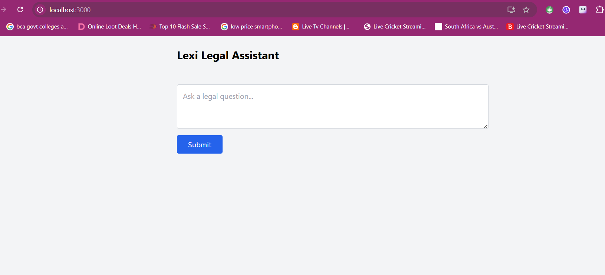
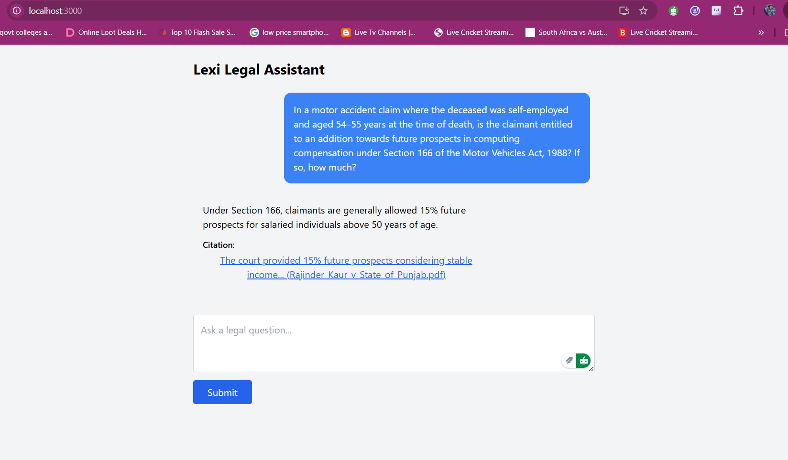
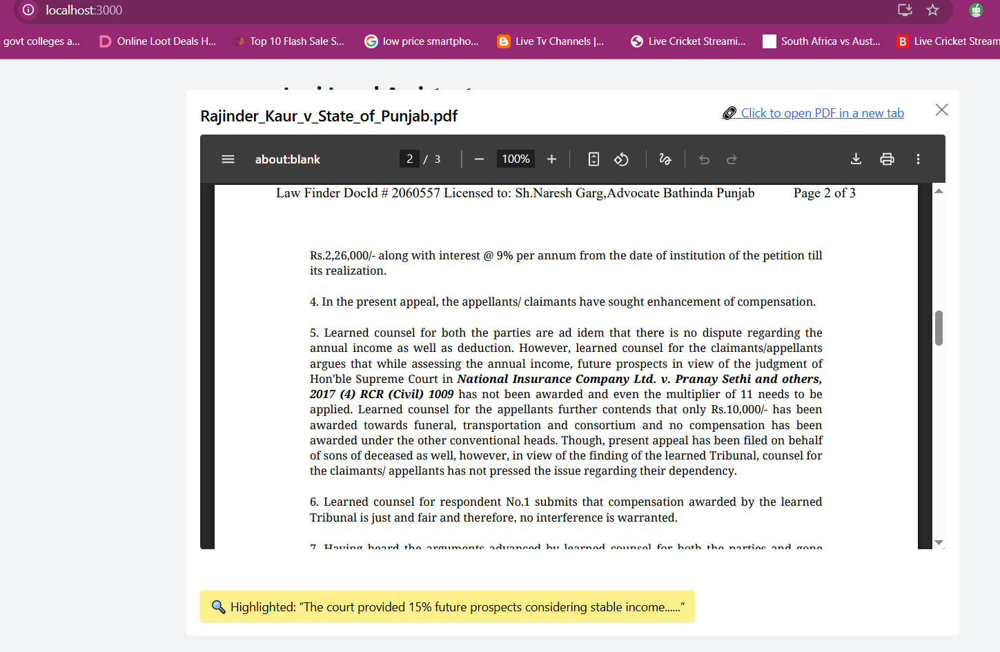

## 📄 README.md

# lexisg-frontend-intern-test

This is a React-based simulation of a Lexi-style legal assistant UI. It allows users to:
- Ask a legal question
- View AI-generated legal responses
- Click on citations to preview or open the referenced legal PDF documents
- Simulate scroll-to-paragraph and highlight of relevant citation content

---

## 🚀 How to Run the Project

```bash
npm install
npm run start
````

Then open: (http://localhost:3000)

---

## 🖼️ Screenshot




---

## 🔗 How Citation Linking Was Handled

### 🔹 1. Citation Modal Logic

When a user clicks a citation:

* A popup modal opens (built with `@headlessui/react`)
* If the citation has a `localPath`, it is embedded inside an `<iframe>` for preview
* If the citation has a `link`, a `🔗 Click to open PDF in new tab` hyperlink is shown

### 🔹 2. Scroll to Paragraph

The simulation uses:

```html
<iframe src="/sample.pdf#page=2" />
```

or

```html
<a href="https://sharepoint-link#page=2" target="_blank">
```

### 🔹 3. Highlight Simulation

A yellow box at the bottom of the modal shows:

```
🔍 Highlighted: “As the age of the deceased was held to be...”
```

---

📍 **Live Demo:**  
🔗 [Hosted App URL](https://lexisg-frontend-intern-test-app.netlify.app/) 

---
